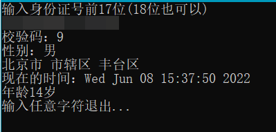

# 身份证归属地数据库

## 介绍
通过输入身份证号码前17位（输入18位也没问题），可计算出第18位校验码和性别、归属地信息。 只支持中国身份证

## 使用说明

下载.exe文件打开即可运行（最好是自己把源代码编译再运行）

## 版本更新

### v1.1.1

### v1.1.0

### v1.0.0

## 提示

请将编码方式改为ANSI(cp936)编码

此仓库已存档，后续我将会用Go和CSharp重写。
